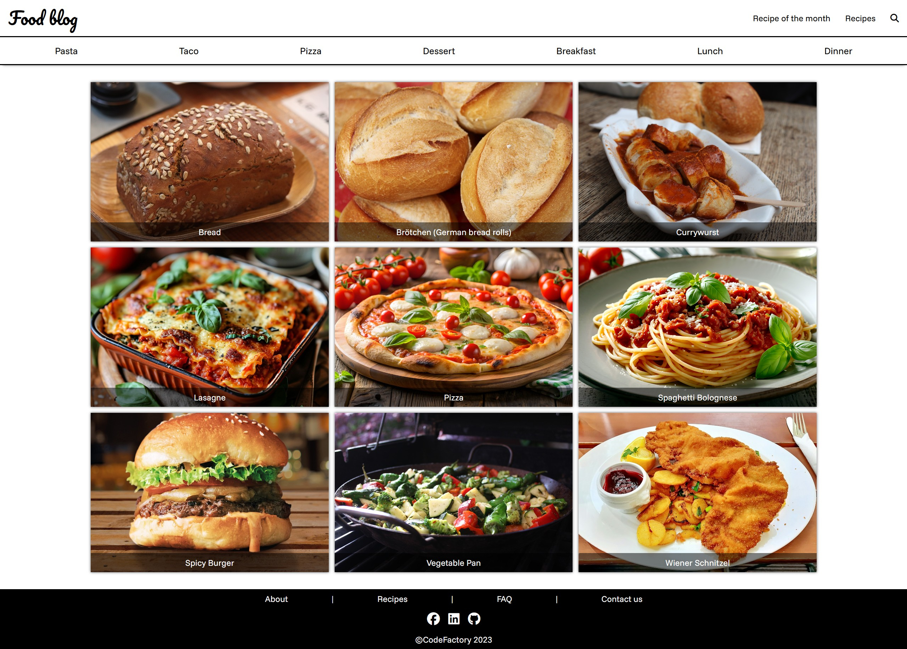
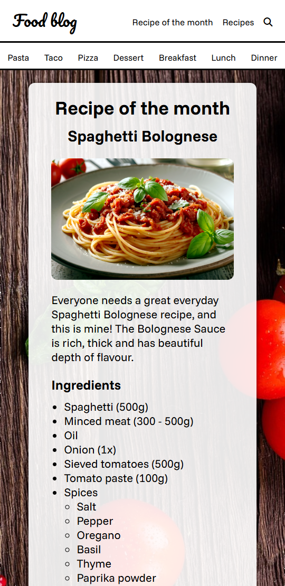
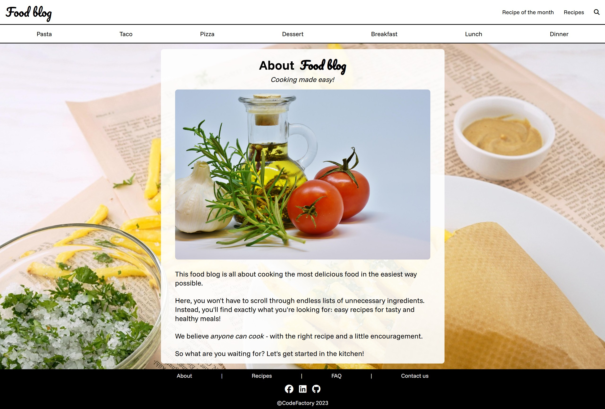

# Food blog

My first exam project at CodeFactory, built using only HTML and CSS. It’s a responsive multi-page food blog showcasing core web layout and styling skills.

[Live Demo](https://kim.codefactory.live/food-blog/)

## Features

- Responsive design with media queries (mobile, tablet)
- Custom fonts
- Navigation bar with site and category links
- Recipe of the Month and About pages
- Grid-based layout for food items
- Footer that stays at the bottom of the page

<table>
  <tr>
    <td>
      
    </td>
    <td rowspan="2">
      
    </td>
  </tr>
  <tr>
    <td>
      
    </td>
  </tr>
  <tr>
    <td>
      
    </td>
  </tr>
</table>
